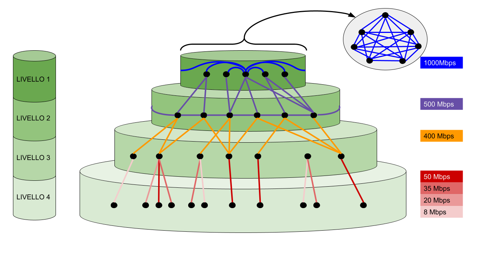

# Clustering dei nodi nel protocollo BitTorrent
Effetto clustering dei nodi in una simulazione del protocollo BitTorrent con NS-3.

Questo progetto presenta una simulazione e uno studio dettagliato della strategia del protocollo BitTorrent, uno dei più popolari protocolli di distribuzione di contenuti peer-to-peer, attenzionando l’effetto del “*clustering of similar-bandwidth peers*”.

## Obiettivo
Il progetto ha come obiettivo quello di simulare uno scenario reale del protocollo
BitTorrent, nel quale viene osservato il clustering dei nodi attivi durante il download di un file.
Per cercare di provocare questo “effetto”, si conducono dei test su un banco di prova simulato
localmente al fine di raccogliere dati da tutti i peer in un ambiente controllato. In particolare, ci si
concentra sul **choking algorithm** per la selezione dei peer, che può essere il fattore
trainante dietro le elevate prestazioni di BitTorrent. 

Questo approccio consente di esaminare il comportamento dei singoli peer che partecipano allo schema e di osservare le loro decisioni e
interazioni durante il download.

L’implementazione del progetto è strutturata come segue:
1. Creazione della rete fisica;
2. Installazione del protocollo BitTorrent sui nodi;
3. Analisi dei file di log creati per rilevare il clustering.

La rete fisica viene creata cercando di emulare la struttura gerarchica della rete Internet. Per questo è stato
pensato di suddividere tutti i nodi della rete in 4 distinti livelli. Il protocollo BitTorrent viene
installato soltanto nei nodi di livello 4 per simulare le reali workstation.

## BitTorrent
BiTorrent è un protocollo peer-to-peer per lo sharing di contenuti. Ha il vantaggio di essere scalabile sul numero di peer
partecipanti. Un tale sistema, capitalizza e sfrutta le capacità di upload di ciascun peer al fine di
migliorare le prestazioni globali del sistema all’aumentare dei peer in gioco.

BitTorrent riesce a risolvere i limiti dei protocolli P2P precedenti:
- la popolarità dei file si concentrava in periodi e luoghi limitati;
- la condivisione di file molto grandi era spesso un problema perché richiedeva troppo tempo
e risorse;
- le fasi di search e di fetch dei file non erano separate all’interno del protocollo

### Fasi del protocollo
Il protocollo comprende 4 fasi principali:
1. **Publish**: un utente crea il file .torrent e definisce un server tracker per quel file;
2. **Search**: viene effettuata fuori dal protocollo, ad esempio sul Web, dove l’utente trova il file
.torrent correlato alla risorsa da scaricare;
3. **Join**: viene contattato il tracker per ottenere una lista di peer;
4. **Fetch**: si contattano i singoli peer dello swarm per scambiare le parti del file
reciprocamente possedute.

Il protocollo BitTorrent si svolge come segue:
- gli utenti trovano il file .torrent dal web (Fase di searching);
- il peer trova l’indirizzo del tracker dentro il file .torrent scaricato e lo contatta. Questo
fornisce al peer una lista random di altri nodi (swarm) che sono interessati alla stessa
risorsa;
- il peer contatta gli altri peer che conosce ed inizia le operazioni di scambio dati;
- periodicamente, ogni peer contatta il tracker per ottenere un nuovo swarm.

## Struttura
### Ns3
Ns-3 è un simulatore di rete interamente open-source destinato principalmente alla ricerca e all'uso educativo.

Il tool mette a disposizione vari modelli, già implementati, che aiutano a comprendere
come operano le reti dati e fornisce agli utenti un engine simulativo per condurre esperimenti e
demo. La ragione principale per utilizzare ns-3 è la possibilità di eseguire studi di reti che
sarebbero difficili o impossibili nei sistemi reali. Permette infatti di studiare il comportamento del
sistema in un ambiente altamente controllato e riproducibile.

### VODSim
VodSim è un modello BitTorrent per il simulatore NS3 abbastanza modulare. Si basa su un
semplice tracker e una sofisticata applicazione client BitTorrent.

## Implementazione
### Struttura
1. Selezione delle parti: quali parti del file condiviso dovrebbero essere acquisite e a quali peer spetta
2. Chocking/unchocking: quali sono i peer remoti che possono richiedere i blocchi dei file dai peer locali
3. Scelta della connessione dei peer: ogni peer gestisce il pool di connessione con gli altri peer. Ciascun peer decide la velocità di banda condivisia e con quali peer stabilire la connessione
4. Scheduling delle richieste: determina come vengono schedulate le richieste dei peer remoti
durante la trasmissione

### Creazione della rete
Affinché la rete sia quanto più fedele a un caso d'uso reale, sono stati creati 4 livelli di rete.
Il primo livello è formato da 10 nodi molto potenti con topologia a grafo fortemente connesso. La
velocità di connessione tra questi nodi è di **1Gbps** (Simulano i **DNS root**).
Al secondo livello troviamo nodi connessi con una topologia a ring e velocità di connessione a
**500Mbps** (Simulano la **dorsale**). Inoltre ciascun nodo del livello 2 è dotato di link a uno, due o tre
nodi random del livello superiore.
Nel livello 3 vi sono nodi non connessi tra di loro, ma solo a nodi del livello immediatamente
superiore (di nuovo da 1 a 3 link a nodi random). La velocità di connessione è di **400Mbps**.
Ogni nodo di livello 4 è connesso solo con un nodo di livello 3 e ospita il software che implementa il
protocollo BitTorrent.

Affinché la clusterizzazione avvenga è necessario che i peer partecipanti al protocollo abbiano
velocità di connessione differenti. Per questo motivo i link L4 ⇔ L3 hanno quattro bande differenti:
**50Mbps**, **35Mbps**, **20Mbps** o **8Mbps**.



Si sono sperimentati due configurazioni della rete torrent, aventi nei vari livelli numero dei nodi in gioco
differenti. Lo scopo è di analizzare l’andamento del clustering dei peer al variare del numero di nodi presenti nella rete.

```c
// OGNI LOCAZIONE DELL'ARRAY È IL NUMERO DI NODI NEL LIVELLO I+1 ESIMO
//int levels[4]={10, 100, 334, 1002}; // Modello 1
int levels[4]={5, 50, 100, 200}; // Modello 2
```
Per implementare BitTorrent si è scelto di definire il metodo “OurTorrentApplication”.
Quest’ultimo prende in input il container dei nodi di quarto livello e un intero come indice dei nodi
effettivamente collegati alla rete (le connessioni tra il livello 3 e 4 sono randomiche).

```c
// 1) Install a BitTorrentTracker application (with default values) on one of the nodes
Ptr<BitTorrentTracker> bitTorrentTracker = Create<BitTorrentTracker> ();
level[3]->Get (0)->AddApplication (bitTorrentTracker);
level[3]->Get (1)->AddApplication (bitTorrentTracker);
level[3]->Get (2)->AddApplication (bitTorrentTracker);
level[3]->Get (3)->AddApplication (bitTorrentTracker);
level[3]->Get (4)->AddApplication (bitTorrentTracker);
```

Prima ancora di installare l’applicazione “ClientBittorrent” ai peer in gioco nel sistema, vengono
scelti i possibili Tracker della rete. Viene istanziato il “BitTorrentTracker” e con la chiamata di
“AddApplication” vengono scelti i primi 5 nodi del quarto livello.

```c
// 2) Load a torrent file via the tracker application
Ptr<Torrent> sharedTorrent = bitTorrentTracker->AddTorrent("input/bittorrent/torrent-data", "input/bittorrent/torrent-data/ourtorrent.dat.torrent");
```

Si istanzia l’oggetto “ sharedTorrent ” di tipo Torrent che punta al file presente nella directory
“torrent-data” denominato “ ourtorrent.dat ” e al corrispettivo file “ ourtorrent.dat.torrent ”.
L’oggetto “ sharedTorrent ” viene associato al Tracker che va a gestire gli swarm dei peer interessati
al file richiesto.

```c
// 3) Install BitTorrentClient applications on the desired number of nodes
for (int i = 5; i < indice; ++i)
{
// Install BitTorrentClient
Ptr<BitTorrentClient> client = Create<BitTorrentClient>();
client->SetTorrent(sharedTorrent);
client->SetMaxPeers(5);
level[3]->Get(i)->AddApplication(client);
bitTorrentClients.Add(client);
}
```
Si scelgono opportunamente i peer del quarto livello ai quali verrà installata sopra l’applicazione
BiTorrent. Vengono esclusi i primi 5 che fungono da Tracker e ci si limita solo ai peer che sono
effettivamente connessi alla rete creata attraverso la variabile “ indice ” che ne tiene il conteggio. A
ognuno di questi viene settato il file da scaricare e condividere “ sharedTorrent ”.

```c
// Make the application node a seeder
DynamicCast<BitTorrentClient>(level[3]->Get(10)->GetApplication(0))->SetInitialBitfield("full");
DynamicCast<BitTorrentClient>(level[3]->Get(20)->GetApplication(0))->SetInitialBitfield("full");
```
Infine vengono settati i seed iniziali della rete BitTorrent, in questo caso il decimo e ventesimo
peer del quarto livello, semplicemente settando la totale disposizione del file in questi nodi (la
dicitura “full”).

Il Client installato sui vari nodi si basa sulla strategia dell’algoritmo *rarest-first*. Il protocollo non
fa altro che selezionare e scegliere il prossimo blocco da scaricare basandosi sulle informazioni
disponibili localmente su ciascun peer. I peer gestiscono così autonomamente una lista dei blocchi
che ciascuno dei loro remoti peer possiedono (un indice su ciascun blocco ne determina la presenza
del numero di copie in rete). Questo set viene aggiornato ogni volta che un peer remoto annuncia
che ha acquisito un nuovo blocco, modificando eventualmente la strategia di scelta successiva.

### Esiti
Vengono definiti dei file di log per analizzare del traffico ottenuto. Ognuno di questi file contiene informazioni importanti sullo
stato del sistema P2P, secondo per secondo.

Il file [ip-bande](./100MB%20NoSeed/output/ip-bande.txt) è responsabile delle associazioni indirizzo IP e banda fisica associata. Un esempio di
entry è il seguente:

> Client Ip: 1.1.5.173 <-> 21000000bps (UP) 21000000bps (DOWN)

Il file [PeerSet](./100MB%20NoSeed/output/PeerSet.txt) è probabilmente il file di log centrale del progetto; riporta infatti, al variare del
tempo, l’insieme di connessioni attive di ciascun peer. Questo ci permette di controllare il
verificarsi della clusterizzazione. Un esempio di dato è riportato a seguire:

> 20s Client Ip: 1.1.5.173 : 1.1.7.185 DOWN: 27.2 UP: 27.2
> 20s Client Ip: 1.1.5.173 : 1.1.7.205 DOWN: 27.2 UP: 27.2

Questa coppia di righe riportano che il client avente IP 1.1.5.173 ha, al ventesimo secondo,
due connessione attive: i peer 1.1.7.185 e 1.1.7.205. Inoltre è riportato il download rate e l’upload rate
verso questi.
[RESULTS-completion-announced](./100MB%20NoSeed/output/RESULTS-completion-announced.dat) è il file in cui vengono salvati i timestamp del momento in cui ogni
nodo termina il download. In ogni riga c’è una coppia Timestamp-ID nodo, come la seguente.

> 135ms: VODSim-165-352269723

[RESULTS-active-clients](./100MB%20NoSeed/output/RESULTS-active-clients.dat) è il file che viene creato al momento dell’istanziazione dei client nel
sistema P2P. L’informazione che dà è sostanzialmente la coppia ID nodo e il relativo indirizzo IP.
Un esempio potrebbe essere il seguente:

> VODSim-160-121877874 1.1.5.173

Per poter studiare i log in maniera automatica un file bash ne scansiona riga per
riga [ourscript](./ourscript.sh). L’idea è quella di scegliere un nodo a caso per ogni tipo di banda e monitorare come variano le
connessioni nel tempo. Il numero di connessioni a nodi similmente potenti aumenta nel tempo.
Finita la fase di collezionamento e organizzazione dei dati inizia la fase di costruzione dei grafici,
che avviene grazie ad una funzione scritta ad hoc in linguaggio Python [graph](./graph.py), tramite la libreria
matplotlib.

La simulazione è stata eseguita impedendo ai peer di fare da “seeder” una volta concluso lo
scaricamento del file. Al termine della simulazione sono state esaminate le connessioni stabilite nel tempo di alcuni peer
random (ad intervalli di 5 secondi). I grafici, per questione di comodità, sono allegati in [Screenshots](./Screenshots).

